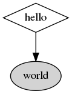

Keep a dependency graph in your README.md
==

This repo defines a GitHub Action _workflow_ useful for OCaml projects
hosted on GitHub and using the Dune build system. It defines
instructions for GitHub to automatically scan your project, generate a
dependency graph with [dune-deps](https://github.com/mjambon/dune-deps),
and commit the resulting image into your project as `.deps/deps.png`.
You can then show the graph as part of your `README.md`. The graph is
updated automatically within minutes of a push.

**Disclaimer**: If the author understands correctly, this is not a GitHub
_action_ proper, but a _workflow_. An action is something you can
include in a yaml workflow. For instance in a workflow, the line
`- uses: actions/checkout@master` invokes the action named "checkout",
which is registered with the GitHub Marketplace.

Setup instructions
--

These are instructions for setting up a job by putting instructions
into your git repo. The advantage is that it's similar to other CI
providers (CircleCI, Travis, etc.) and lets you customize it without
too much magic.

### Step 1: Put config into your repo

Copy
[`.github/workflows/dune-deps.yml`](.github/workflows/dune-deps.yml)
into your repo, same path. GitHub will find it automatically, as long
as Actions are not disabled for your repo or organization.

It can be achieved with the following instructions, from the root of
your git project:

```bash
# Copy config
mkdir -p .github/workflows
curl -L -o .github/workflows/dune-deps.yml \
  https://raw.githubusercontent.com/mjambon/dune-deps-action/master/.github/workflows/dune-deps.yml

# Normal add/commit/push
git add .github/workflows/dune-deps.yml
git commit .github/workflows/dune-deps.yml
git push origin master
```

Then visit the "Actions" tab on your project's GitHub page. You should see
some work being done for the "dependency graph" workflow.

If successful, there should now be a `.deps` folder at the root of your
project.

### Step 2: Show the graph

Insert the following snippet in your main `README.md` file:

```

```

For example, it might look something like this:


Note: It may take several minutes for the image rendered by the GitHub
website to refresh after a change in the git repo.

### Step 3: Optional customization

If the `dune-deps` command failed or you're not getting the graph you
want, you can customize it by editing the relevant line in
`.github/workflows/dune-deps.yml`. Install `dune-deps` on your
development machine (e.g. `opam install dune-deps`) and check out
the available options with `dune-deps --help`. See also the
[dune-deps homepage](https://github.com/mjambon/dune-deps) for common
usage scenarios.

Troubleshooting
--

If anything goes wrong or is harder than it should, please open an
issue to let us know.
